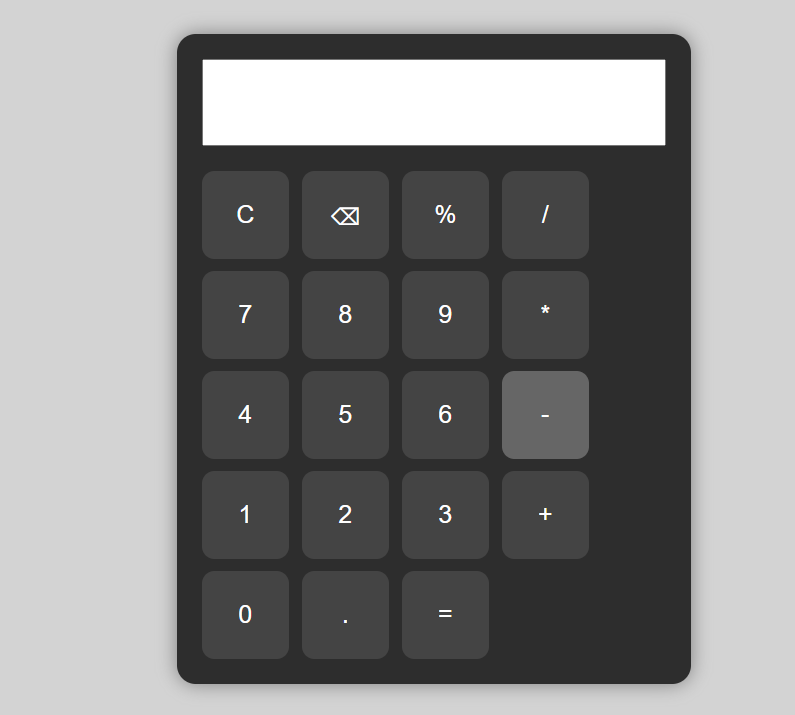

# Calculator

A responsive web-based calculator built using **HTML**, **CSS**, and **JavaScript**. It performs basic arithmetic operations through a clean and user-friendly interface.

## Features

- Perform addition, subtraction, multiplication, and division
- Clear the display
- Delete the last entered digit
- Responsive design for desktop and mobile browsers
- Simple and intuitive user interface

## Technologies Used

- HTML5
- CSS3
- JavaScript (ES6)

## Project Structure

```
calculator/
│── index.html
│── style.css
│── script.js
└── README.md
```

## Getting Started

1. Clone the repository:

```bash
git clone https://github.com/your-username/calculator.git
```

2. Open the project folder.

3. Open `index.html` in your preferred web browser.

## Future Enhancements

- Keyboard input support
- Scientific calculator functions
- Calculation history
- Dark mode
- Theme customization

## Screenshot


```markdown

```

## Author

**Thoti Lohith**

- GitHub: https://github.com/Lohith-CSE-AIML
- LinkedIn: https://www.linkedin.com/in/thoti-lohith/
